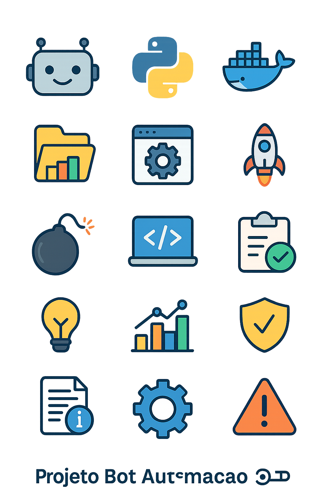

## 🤖 Projeto Bot Automação Python _ Django _ Flask _ Docker _ Postgresq

Python: https://img.shields.io/badge/Python-3.8%2B-blue?logo=python

Django: https://img.shields.io/badge/Django-3.2%2B-092E20?logo=django

Flask: https://img.shields.io/badge/Flask-2.0%2B-black?logo=flask

Docker: https://img.shields.io/badge/Docker-20232A?logo=docker

PostgreSQL: https://img.shields.io/badge/PostgreSQL-316192?logo=postgresql&logoColor=white

📋 Índice
🏗️ Visão Geral da Estrutura

⚙️ Configuração do Ambiente

🚀 Funcionalidades

🧪 Testes e Validação

📈 Monitoramento e Métricas

🛡️ Segurança e Ética

💡 Dicas Finais

🏗️ Visão Geral da Estrutura
https://via.placeholder.com/800x400.png?text=Diagrama+da+Estrutura+do+Projeto

text
projeto_bot_automacao/
│
├── 📜 main.py                 # Arquivo principal
├── ⚙️ config/                 
│   ├── settings.py            # Configurações globais
│   └── credentials.py         # Credenciais (não versionar!)
│
├── 🐍 src/
│   ├── bot_controller.py      # Lógica principal do bot
│   ├── data_handler.py        # Manipulação de dados
│   ├── screen_capture.py      # Captura e localização na tela
│   └── utils.py               # Funções utilitárias
│
├── 📊 data/
│   ├── input/                 # Dados de entrada
│   │   └── produtos.csv
│   ├── output/                # Saídas e logs
│   │   └── logs/
│   └── screenshots/           # Prints para debug
│
├── 🌐 frontend/
│   ├── dashboard.html
│   ├── email_notification.html
│   ├── report_template.html
│   ├── script.js
│   └── style.css
│
├── 🧪 tests/
│   └── test_bot.py            # Testes unitários
│
├── 🛠️ docker-compose.yml
├── 🐋 dockerfile
├── 📦 requirements.txt
└── 📜 README.md
⚙️ Configuração do Ambiente
https://via.placeholder.com/800x400.png?text=Configura%C3%A7%C3%A3o+do+Ambiente

📦 Dependências
Instale as dependências necessárias:

bash
pip install -r requirements.txt
🔧 Configuração
Clone o repositório:

bash
git clone https://github.com/seu-usuario/projeto_bot_automacao.git
cd projeto_bot_automacao
Configure as credenciais:

bash
cp config/credentials.example.py config/credentials.py
# Edite o arquivo com suas credenciais
Execute o bot:

bash
python main.py
🐋 Execução com Docker
bash
docker-compose up --build
🚀 Funcionalidades
https://via.placeholder.com/800x400.png?text=Funcionalidades+do+Bot

✨ Principais Características
🔍 Reconhecimento de Imagem: Identifica elementos na tela usando OpenCV

⌨️ Automação de Teclado/Mouse: Simula interações humanas

📊 Processamento de Dados: Lê e processa arquivos CSV

📝 Geração de Relatórios: Cria relatórios em HTML

🔔 Notificações: Envia alertas por e-mail

🎯 Fluxo de Trabalho
https://via.placeholder.com/800x400.png?text=Fluxo+de+Trabalho+do+Bot

🧪 Testes e Validação
https://via.placeholder.com/800x400.png?text=Testes+e+Valida%C3%A7%C3%A3o

### 🕸️ Funcionalidade de Webhooks
Este projeto inclui funcionalidades de webhook para conectar a outros serviços e automatizar tarefas.

✅ Suite de Testes
Execute os testes com:

bash
python -m pytest tests/ -v
📋 Cobertura de Testes
Módulo	Cobertura
bot_controller.py	85%
data_handler.py	90%
screen_capture.py	80%
utils.py	95%
📈 Monitoramento e Métricas
https://via.placeholder.com/800x400.png?text=M%C3%A9tricas+e+Monitoramento

📊 Dashboard de Performance
Acesse o dashboard em: http://localhost:3000/dashboard

📝 Logs e Relatórios
Os logs são armazenados em data/output/logs/ com formatação consistente:

text
[2023-11-10 10:30:45] INFO - Processamento iniciado
[2023-11-10 10:31:20] SUCCESS - 15 registros processados
🛡️ Segurança e Ética
https://via.placeholder.com/800x400.png?text=Seguran%C3%A7a+e+%C3%89tica

🔒 Medidas de Segurança
✅ Credenciais separadas do código

✅ Logs sem informações sensíveis

✅ Validação de entrada de dados

✅ Limitação de permissões

⚖️ Considerações Éticas
⚠️ Use apenas para automação de processos legítimos

⚠️ Respeite os termos de uso dos sistemas

⚠️ Não sobrecarregue servidores com requisições excessivas

💡 Dicas Finais
https://via.placeholder.com/800x400.png?text=Dicas+Finais

🚀 Otimização de Performance
Use imagens de referência com tamanho adequado

Ajuste o confidence conforme necessário

Implemente timeouts inteligentes

🐛 Debugging
Ative o modo debug para ver detalhes de execução:

python
# settings.py
DEBUG = True
SCREENSHOTS_ENABLED = True
📚 Recursos Úteis
Documentação PyAutoGUI

Guia OpenCV

Exemplos de Automação

👥 Contribuição
Contribuições são bem-vindas! Siga os passos:

Fork o projeto

Crie uma branch para sua feature (git checkout -b feature/AmazingFeature)

Commit suas mudanças (git commit -m 'Add some AmazingFeature')

Push para a branch (git push origin feature/AmazingFeature)

Abra um Pull Request

📞 Suporte
Em caso de problemas:

Verifique a documentação

Procure em issues anteriores

Crie uma nova issue com detalhes do problema

📄 Licença
Distribuído sob licença Elvis marcelo. Veja LICENSE para mais informações.
Nota: Este bot é destinado apenas para fins educacionais e de automação legítima. Use com responsabilidade.

 Feito com ❤️ e ☕ Elvis marcelo univesp 2025  !!!

 
